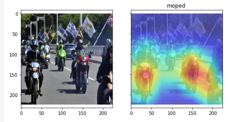

# Object-localization-using-Global-Average-Pooling-GAP
ResNet-50 used for object localization on sample images using features learned for classification.

## Description
In this notebook, ResNet-50 CNN, trained for a classification task, is used for object localization. The localization is expressed as a heat map where color intensity identifies regions important for the CNN to perform the object identification task.

The localization is achieved by computing a Class Activation Map. The localization is achieved during the forward pass of the image.

Convolutional layers of CNNs behave as object detectors despite no supervision on the location of the object. Yet this ability is lost when fully-connected layers are used for classification. Several original network architectures such as ResNet propose to avoid the traditional use of fully connecter layers by using Global Average Pooling. This allows to retain the localization capability until the very end of the network.

Such networks apply Global Average Pooling (GAP) to the convolutional feature volume obtained at the end of the network. Those models use the result as features for a fully-connected layer that produces the desired output (categorical or otherwise). Given this simple connectivity structure, the image regions important to the output can be identified by projecting back the weights of the output layer on to the convolutional feature maps, a technique called class activation mapping. ResNet-50 uses such GAP layer to feed its final prediction layer.

Note that GAP is initially used to reduce the number of parameters of a CNN model. Indeed GAP removes the need for the traditional portion of two to three fully connected layers by providing an output which can sipmply be used as a input to the final classification task. The localization capability is therefore an additional advantage of this approach.

Details about the topic and intuition can be found in the original paper from Zhou.

http://cnnlocalization.csail.mit.edu/Zhou_Learning_Deep_Features_CVPR_2016_paper.pdf

Important note:
- The notebook is based on Alexis Cook’s code from her original work and paper which can be found here:

https://alexisbcook.github.io/2017/global-average-pooling-layers-for-object-localization/

- The original code I used can be found in Alexis Cook's repository:

https://github.com/alexisbcook/ResNetCAM-keras

## Notebook content:
•	Image preprocessing
•	Import ResNet, collect weights mapping GAP layer to prediction output layer
•	Get predicted class and Class Activation Mapping
•	Assemble the parts to display heatmap
•	Run the model and display results

## Implementation:
•	Download the repository
•	Insert your own images in the “images” folder
•	Run the notebook

## Additional notes:
- Refer to Alexis Cook’s informative paper for more information on the principles.

## Results

